# Inventory Module — Complete Developer Guide

> Ek jagah sab kuch. Naya developer aaye toh seedha kaam shuru kar sake.
> Customer module README bhi padho — wahan middleware, caching, auth patterns cover hain.

---

## Table of Contents

1. [Inventory Kya Hai?](#inventory-kya-hai)
2. [File Structure](#file-structure)
3. [Architecture Overview](#architecture-overview)
4. [Transaction Types](#transaction-types)
5. [Core Service Functions — inventory.service.js](#core-service-functions)
6. [Product Service Functions — product.service.js](#product-service-functions)
7. [Product Model — Key Concepts](#product-model--key-concepts)
8. [InventoryTransaction Model](#inventorytransaction-model)
9. [Price Calculation Flow](#price-calculation-flow)
10. [Stock Status Logic](#stock-status-logic)
11. [Known Bugs](#known-bugs)
12. [Common Gotchas](#common-gotchas)
13. [Quick Start for New Developer](#quick-start-for-new-developer)

---

## Inventory Kya Hai?

Ek jewelry shop mein inventory = **har item ka track** rakhna:

```
Kitna stock hai         → stock.quantity
Kahan se aaya           → InventoryTransaction (PURCHASE/IN)
Kahan gaya              → InventoryTransaction (SALE/OUT)
Physical count mismatch → InventoryTransaction (ADJUSTMENT)
Customer wapas laya     → InventoryTransaction (RETURN)
```

**Har stock change ke saath ek InventoryTransaction document banta hai** — yeh audit trail hai. Koi bhi change chhupaaya nahi ja sakta.

---

## File Structure

```
src/api/inventory/
├── inventory.service.js      # Core stock operations (decrease, increase, adjust...)
├── inventory.constants.js    # TRANSACTION_TYPES, REFERENCE_TYPES enums

src/api/product/
├── product.service.js        # Product CRUD + reserve/sell/price calculate

src/models/
├── Product.js                # Product schema + instance methods
├── InventoryTransaction.js   # Transaction log schema + static methods

src/utils/
├── AppError.js               # NotFoundError, InsufficientStockError, etc.
├── cache.js                  # Redis cache wrapper
├── eventLogger.js            # Activity audit logger
```

---

## Architecture Overview

```
Sale Service / Purchase Service / API Controller
         │
         ▼
  inventory.service.js   ←──────────────────────────────┐
  (stock operations)                                     │
         │                                               │
         ├── Product.findOneAndUpdate()  (atomic!)       │
         │   or Product.findById() + product.save()      │
         │                                               │
         ├── InventoryTransaction.create()               │
         │   (har change ka permanent log)               │
         │                                               │
         └── product.markAsSold()  (if qty = 0)          │
                                                         │
  product.service.js  ────────────────────────────────── ┘
  (product CRUD, uses inventory.service internally)
```

**Key principle:** `inventory.service.js` directly use hoti hai Sale, Purchase modules se. `product.service.js` bhi internally `adjustStock()` call karta hai.

---


## Transaction Types

```javascript
// inventory.constants.js

TRANSACTION_TYPES = {
  IN           // Stock manually add hua
  OUT          // Stock manually remove hua
  ADJUSTMENT   // Physical count mismatch correction
  SALE         // Product bika
  PURCHASE     // Purchase se stock aaya
  RETURN       // Customer ne wapas kiya
  TRANSFER_IN  // Doosri shop se aaya
  TRANSFER_OUT // Doosri shop ko gaya
  DAMAGE       // Damage/loss
  RESERVED     // Customer ke liye reserve (qty NAHI ghatती)
  UNRESERVED   // Reservation cancel (qty NAHI badhati)
}

REFERENCE_TYPES = {
  product_creation   // Product pehli baar banate waqt
  sale               // Sale document se
  purchase           // Purchase document se
  return             // Return document se
  manual_adjustment  // Admin ne manually kiya
  transfer           // Transfer document se
  damage             // Damage report se
  reservation        // Reservation se
  stock_update       // Direct stock update
}
```

**Important:**
- `RESERVED` aur `UNRESERVED` mein **stock quantity nahi badalta** — sirf `saleStatus` change hota hai
- Har transaction mein `previousQuantity` aur `newQuantity` dono save hote hain — history complete rehti hai

---

## Core Service Functions

### 1. decreaseStock() — Sabse Important!

**Kab call hota hai:** Sale hoti hai ya damage report aata hai.

```javascript
await decreaseStock({
  organizationId,
  shopId,
  productId,
  quantity,          // kitna kam karna hai
  referenceId,       // sale ka _id
  referenceNumber,   // "INV-000042"
  value,             // kitne ka gaya (sale amount)
  performedBy,       // userId
  customerId,        // optional — sirf sale mein hoga, damage mein nahi
  session,           // MongoDB session — transaction ke liye
})
```

**Atomic Operation — Bahut Important!**

```javascript
// Yeh ek hi DB operation hai — check + update ek saath
const product = await Product.findOneAndUpdate(
  {
    _id: productId,
    'stock.quantity': { $gte: quantity }  // condition: stock kaafi hai?
  },
  { $inc: { 'stock.quantity': -quantity } },  // agar hai toh kam karo
  { new: true, session }
);
```

**Kyun atomic?** — Race condition rokne ke liye.

```
Problem: Sirf 1 ring bachi hai.
         Customer A aur B dono ek saath khareedna chahte hain.

Non-atomic (BAD):
  A: check → qty=1 ✅ → ...
  B: check → qty=1 ✅ → ...
  A: update → qty=0
  B: update → qty=-1 ❌ NEGATIVE STOCK!

Atomic (GOOD):
  A: findOneAndUpdate → qty=1 match → qty=0 ✅
  B: findOneAndUpdate → qty=0, $gte 1 FAIL → null return ❌ blocked!
```

**Null aane ke 2 reasons:**

```javascript
if (!product) {
  const exists = await Product.findById(productId)
  if (!exists) throw new NotFoundError('Product not found')
  // exists mila matlab product tha, lekin stock kam tha
  throw new InsufficientStockError(`Available: ${exists.stock.quantity}`)
}
```

**markAsSold condition:**

```javascript
if (product.stock.quantity === 0 && customerId) {
  await product.markAsSold(customerId)
}
// customerId nahi hoga damage case mein → markAsSold nahi hoga
// Math.max(0, qty - 1) → negative stock impossible
```

---

### 2. increaseStock() — Simple, Non-Atomic

**Kab call hota hai:** Purchase aata hai shop mein.

```javascript
// Non-atomic — race condition ka risk nahi
// (stock badhane mein dono valid hain, ghatane mein nahi)
const product = await Product.findById(productId)
await product.updateStock(quantity, 'add')
```

**updateStock() model method:**

```javascript
// Quantity update + status auto-update
if (qty === 0) status = 'out_of_stock'
else if (qty <= reorderLevel) status = 'low_stock'
else status = 'in_stock'
```

---

### 3. returnStock() — ⚠️ BUG HAI YAHAN!

**Kab call hota hai:** Customer ne product wapas kiya.

```javascript
const previousQty = product.stock.quantity
await product.updateStock(quantity, 'add')  // stock wapas add ✅
// InventoryTransaction create ✅

// ❌ BUG: saleStatus update NAHI ho raha!
// Product ka saleStatus abhi bhi 'sold' rahega
// Aur woh available nahi dikhega naye customer ko!
```

**Fix karna hai:**

```javascript
await product.updateStock(quantity, 'add')

// YEH ADD KARO:
if (product.saleStatus === 'sold') {
  product.saleStatus = 'available'
  product.soldTo = null
  product.soldDate = null
  await product.save()
}
```

---

### 4. adjustStock() — Manual Correction

**Kab call hota hai:** Physical count kiya aur system se match nahi hua.

```javascript
await adjustStock({
  productId,
  newQuantity: 45,  // actual count
  reason: 'Physical stock count — 5 rings missing',
  performedBy: userId,
})
```

**Internal logic:**

```javascript
const difference = newQuantity - previousQty
// difference = 45 - 50 = -5

await product.updateStock(
  Math.abs(difference),          // 5
  difference > 0 ? 'add' : 'subtract'  // subtract
)
// Result: 50 - 5 = 45 ✅
```

---

### 5. createProductFromPurchase() — Purchase se naya Product

**Kab call hota hai:** Purchase module jab koi naya item khareedta hai jo pehle inventory mein nahi tha.

```javascript
// Auto features:
productCode = await Product.generateProductCode(shopId)  // PRD000043
costPrice = item.itemTotal / item.quantity
sellingPrice = costPrice * 1.2  // 20% markup default

// Initial transaction:
transactionType: TRANSACTION_TYPES.IN
previousQuantity: 0
newQuantity: item.quantity
reason: 'Initial stock from purchase'
```

---

## Product Service Functions

### createProduct()

**Flow:**

```
1. generateProductCode(shopId, 'PRD')    → PRD000043
2. MetalRate.getCurrentRate(shopId)      → rates (error if not set!)
3. netWeight = grossWeight - stoneWeight
4. calculateProductPrice(data, rates)    → full pricing
5. stones forEach → totalStonePrice calculate
6. stockStatus → in_stock/low_stock/out_of_stock
7. Category validate (OTHER mapping bhi)
8. Product.create({...})
9. adjustStock() → initial transaction log
10. shop.statistics.totalProducts += 1
11. eventLogger.logProduct(...)
12. cache.set(productKey, product, 1800)
```

**Metal rates set nahi hain toh error:**

```javascript
if (!metalRates) {
  throw new ValidationError('Metal rates not found. Please set metal rates first.')
}
```

**'OTHER' category mapping:**

```javascript
// Frontend se 'OTHER' string aa sakta hai
if (finalCategoryId === 'OTHER') {
  finalCategoryId = process.env.OTHER_CATEGORY_ID  // .env se real ObjectId
}
```

---

### calculateProductPrice()

```
metalValue   = netWeight × metalRate (purity ke hisaab se)
makingCharges = per_gram | percentage | flat
stoneValue   = Σ(stonePrice × pieceCount) per stone
otherCharges = misc
               ─────────────────────────────
subtotal     = metalValue + making + stone + other
discount     = percentage | flat (on subtotal)
afterDiscount = subtotal - discount
GST          = afterDiscount × gstPercentage (default 3%)
               ─────────────────────────────
totalPrice   = afterDiscount + GST
sellingPrice = totalPrice
```

**Metal purity → rate mapping:**

```javascript
gold:
  24K  → gold24K.sellingRate
  22K  → gold22K.sellingRate
  916  → gold22K.sellingRate  // 916 = 22K equivalent
  18K  → gold18K.sellingRate

silver:
  999  → pure.sellingRate
  925  → sterling.sellingRate

platinum:
  → platinum.sellingRate
```

---

### reserveProduct()

```javascript
// saleStatus checks:
if (product.saleStatus === 'sold') → 400 already sold
if (product.saleStatus === 'reserved') → 400 already reserved
if (product.stock.quantity < 1) → 400 out of stock

// Reserve:
saleStatus = 'reserved'
reservedFor = { customerId, reservedDate, expiryDate: +7 days }

// NOTE: stock.quantity NAHI ghatata reservation mein!
// Sirf saleStatus change hoti hai
```

---

### markAsSold()

```javascript
// Product model method:
this.saleStatus = 'sold'
this.soldDate = new Date()
this.soldTo = customerId
this.stock.quantity = Math.max(0, this.stock.quantity - 1)
// Math.max(0, ...) → negative stock impossible
```

---

## Product Model — Key Concepts

### Weight Fields

```
grossWeight = ring ka total weight (gold + diamond + everything)
stoneWeight = diamond/stone ka weight
netWeight   = grossWeight - stoneWeight  ← auto-calculated in pre('save')
```

**Pre-save middleware auto-calculate karta hai:**

```javascript
productSchema.pre('save', function(next) {
  // Net weight auto calculate
  this.weight.netWeight = Math.max(0, gross - stone)

  // Stone value aggregate
  this.pricing.stoneValue = this.stones.reduce(
    (sum, s) => sum + (s.totalStonePrice || 0), 0
  )

  // Primary image set
  // ...
  next()
})
```

---

### Status vs saleStatus — Dono Alag Hain!

```
status (stock-based):
  in_stock       → qty > reorderLevel
  low_stock      → 0 < qty <= reorderLevel
  out_of_stock   → qty === 0
  discontinued   → band kar diya
  sold           → (legacy, ab saleStatus use karo)

saleStatus (sale-based):
  available  → koi nahi khareed raha
  reserved   → customer ne hold kiya
  sold       → bik gaya
  on_hold    → admin ne roka
  returned   → wapas aaya
```

---

### Virtuals

```javascript
product.profitMargin    // ((selling - cost) / cost) × 100
product.isLowStock      // qty <= reorderLevel
product.isOutOfStock    // qty === 0
product.totalStoneCount // Σ stone.pieceCount
```

---

### Product Code Generation — Retry Loop

```javascript
static generateProductCode(shopId, prefix = 'PRD'):
  1. Last product dhundo (sort by createdAt desc)
  2. Code extract → parse number
  3. newNumber = lastNumber + 1
  4. Duplicate check karо
  5. Duplicate mila? attempts++ aur retry (max 5)
  6. Final fallback: PRD + Date.now().slice(-6)
```

**Kyun retry?** — `createdAt` sort use karta hai. Agar 2 products same millisecond mein create hon toh same "last product" milega → same code → duplicate → retry!

**Customer code mein retry nahi tha** — woh `customerCode` field se sort karta tha (sequential, predictable). Product wala `createdAt` se sort karta hai (timestamp collision possible).

---

## InventoryTransaction Model

### Key Fields

```javascript
{
  transactionType: 'SALE' | 'PURCHASE' | 'RETURN' | ...
  quantity: 2,              // kitna change hua
  previousQuantity: 50,     // pehle kitna tha
  newQuantity: 48,          // ab kitna hai
  referenceType: 'sale',
  referenceId: saleId,      // kaunsi sale se linked
  referenceNumber: 'INV-042',
  value: 25000,             // financial impact
  performedBy: userId,
  reason: 'Product sold via INV-042'
}
```

### Virtuals

```javascript
transaction.quantityChange  // newQty - previousQty (positive = inbound, negative = outbound)
transaction.isInbound       // IN, PURCHASE, RETURN, TRANSFER_IN, UNRESERVED
transaction.isOutbound      // OUT, SALE, TRANSFER_OUT, DAMAGE, RESERVED
```

### Static Methods

```javascript
InventoryTransaction.getProductHistory(productId, limit)
InventoryTransaction.getByDateRange(shopId, startDate, endDate)
InventoryTransaction.getByType(shopId, transactionType, limit)
InventoryTransaction.getInboundTransactions(shopId, days)
InventoryTransaction.getOutboundTransactions(shopId, days)
InventoryTransaction.getAdjustments(shopId, days)
InventoryTransaction.getMovementSummary(shopId, days)  // aggregate by type
```

---

## Stock Status Logic

```
Stock change hota hai
        ↓
updateStock() method call hota hai
        ↓
quantity === 0        → status = 'out_of_stock'
quantity <= reorder   → status = 'low_stock'
quantity > reorder    → status = 'in_stock'
```

**getLowStockProducts():**

```javascript
// Default: low_stock ya out_of_stock status wale
// Custom threshold: stock.quantity <= threshold wale
{
  products: [...],
  meta: {
    totalLowStockItems: 15,
    criticalItems: 3   // qty === 0 wale
  }
}
```

---

## Known Bugs

### Bug 1: returnStock() — saleStatus update missing

**File:** `src/api/inventory/inventory.service.js`

**Problem:**

```javascript
// Current code — INCOMPLETE
await product.updateStock(quantity, 'add')
// saleStatus abhi bhi 'sold' rahega!
```

**Fix:**

```javascript
await product.updateStock(quantity, 'add')

if (product.saleStatus === 'sold') {
  product.saleStatus = 'available'
  product.soldTo = null
  product.soldDate = null
  await product.save()
}
```

**Impact:** Returned products sale ke liye available nahi dikhte `findAvailableForSale()` query mein.

---

### Bug 2: getStockMovement() — shopId unused

**File:** `src/api/inventory/inventory.service.js`

```javascript
export const getStockMovement = async ({ shopId, productId, limit }) => {
  return InventoryTransaction.getProductHistory(productId, limit)
  // shopId pass hua lekin use nahi hua!
}
```

**Actual impact:** Minimal — `productId` globally unique hai (MongoDB ObjectId), isliye ek product ek hi shop mein hoga. Lekin confusing code hai, future developer ke liye misleading.

---

## Common Gotchas

### 1. Session pass karna zaroori hai transactions mein

```javascript
// Sale service mein session banate hain:
const session = await mongoose.startSession()
session.startTransaction()

// Phir saari operations mein pass karo:
await decreaseStock({ ..., session })
await Sale.create([...], { session })
await session.commitTransaction()

// Koi ek fail → sab rollback!
```

### 2. increaseStock atomic nahi hai — intentionally

```javascript
// increaseStock mein findById + save (2 steps) — OK hai
// Kyunki stock badhane mein race condition nahi
// (dono customers ka stock add hona valid hai)
// Sirf ghatane mein race condition hoti hai
```

### 3. Price calculation mein metal rates required hain

```javascript
// Pehle shop ke liye metal rates set karo:
// PATCH /api/v1/shops/:shopId/settings/metal-rates

// Product create karne se pehle rates honi chahiye,
// warna ValidationError aayega
```

### 4. Category 'OTHER' string bhejo — ObjectId nahi

```javascript
// Frontend se:
{ categoryId: 'OTHER' }  // string

// Backend internally convert karta hai:
finalCategoryId = process.env.OTHER_CATEGORY_ID  // real ObjectId
```

### 5. Reservation mein stock nahi ghatata

```javascript
// Yeh confusing hai! Reservation ke baad:
product.saleStatus = 'reserved'  ✅
product.stock.quantity unchanged  ← dhyan rakho!

// Isliye available check mein:
Product.findAvailableForSale() → saleStatus: 'available' filter lagata hai
// reserved product wahan nahi aayega
```

### 6. adjustStock() call hota hai createProduct() mein bhi

```javascript
// Product banane ke baad:
await adjustStock({
  newQuantity: product.stock.quantity,
  reason: 'Initial stock entry',
})
// Isliye pehle product ka bhi InventoryTransaction banta hai
// Previous: 0, New: quantity
```

### 7. bulkDeleteProducts loop use karta hai — slow!

```javascript
// Current code:
for (const product of products) {
  await product.softDelete()  // N separate DB calls!
}

// Better hota:
await Product.updateMany(
  { _id: { $in: productIds } },
  { $set: { deletedAt: new Date(), isActive: false } }
)
```

---

## Quick Start for New Developer

```bash
# Files padho is order mein:
1. src/api/inventory/inventory.constants.js   (TRANSACTION_TYPES samjho)
2. src/models/InventoryTransaction.js         (schema + static methods)
3. src/models/Product.js                      (schema + instance methods)
4. src/api/inventory/inventory.service.js     (core operations)
5. src/api/product/product.service.js         (product CRUD)
```

**Naya stock operation add karna ho toh:**

```
1. inventory.constants.js mein naya TRANSACTION_TYPE add karo
2. inventory.service.js mein naya function banao
3. InventoryTransaction.create() call karna mat bhoolo (audit trail!)
4. product.service.js mein integrate karo agar product-level change hai
```

**Price recalculate karna ho:**

```javascript
await recalculatePrice(productId, shopId, organizationId, {
  useCurrentRate: true   // current metal rates se calculate
  // ya
  customRate: 6500       // manual rate de sakte ho
}, userId)
```

**Stock history dekhna ho:**

```javascript
await getProductHistory(productId, shopId, organizationId, limit=50)
// Returns: { product: {...}, history: [...transactions] }
```

---

## Inventory ka Full Flow — Ek Sale Example

```
Customer ne 2 gold rings khareedin

1. Sale Service → decreaseStock() call karta hai (session ke saath)
   ├── findOneAndUpdate: qty >= 2? → qty - 2 (atomic!)
   ├── product null? → InsufficientStockError
   ├── product.stock.quantity = 48
   ├── InventoryTransaction.create({ type: SALE, prev: 50, new: 48 })
   └── qty === 0? → markAsSold() nahi (48 > 0)

2. Payment processed → session.commitTransaction()
   ├── Stock permanently 50 → 48
   └── Transaction log permanent

3. Agar kuch fail hota beech mein:
   └── session.abortTransaction() → sab rollback, stock wapas 50
```

---

*Last updated: Inventory Module v1.0*
*Related: Customer Module README (middleware, auth, caching patterns)*
*Bugs found: returnStock() saleStatus fix pending, getStockMovement() shopId unused*