# Auth System Documentation
---
## Table of Contents

1. [Architecture Overview](#architecture-overview)
2. [File Structure](#file-structure)
3. [Backend — Route → Middleware → Controller→Service](#backend)
4. [Frontend — Hook → Slice → Service](#frontend)
5. [Redux Store](#redux-store)
6. [Token System](#token-system)
7. [2FA System](#2fa-system)
8. [All APIs — Quick Reference](#all-apis)
9. [Security Patterns](#security-patterns)
10. [Common Mistakes](#common-mistakes)

---
## Architecture Overview
```
USER
  |
  | clicks button
  ↓
COMPONENT (React)
  |
  | calls hook
  ↓
HOOK (useAuth)
  |
  | dispatch
  ↓
SLICE (authSlice / userSlice / permissionsSlice)
  |
  | calls service
  ↓
SERVICE (authService.ts)
  |
  | axios call
  ↓
BACKEND
  |
  Route → Middleware → Controller → Service → Database
```

---

## File Structure

```
frontend/
  src/
    api/
      services/
        authService.ts      ← Saari axios API calls
      endpoints.ts          ← Saare API URLs ek jagah
      axios.ts              ← Axios instance + retryRequest
      baseQuery.ts          ← RTK Query base + token refresh
      interceptors/
        authInterceptor.ts  ← Har request mein Bearer token attach
        errorInterceptor.ts ← Error handling (401, 403, 429...)

    store/
      index.ts              ← Redux store + redux-persist config
      slices/
        authSlice.ts        ← isAuthenticated, tokens, shopIds
        userSlice.ts        ← User profile, preferences
        permissionsSlice.ts ← Shop permissions, orgPermissions

    services/
      auth/
        tokenService.ts     ← localStorage mein tokens save/get/clear
      storage/
        localStorageService.ts ← localStorage wrapper

    hooks/
      auth/
        useAuth.ts          ← Main hook — sab kuch ek jagah
        useAuthActions.ts   ← login, logout, register
        useAuthState.ts     ← isAuthenticated, role, etc.
        useUserProfile.ts   ← getUser, updateProfile
        usePasswordActions.ts ← changePassword, forgotPassword
        use2FA.ts           ← enable2FA, verify2FA, disable2FA
        useSession.ts       ← getSessions, revokeSession
        useShop.ts          ← switchShop, clearShop
        useToken.ts         ← checkTokenValidity

backend/
  src/
    modules/
      auth/
        auth.routes.ts      ← Saare routes
        auth.controller.ts  ← Request handle karo
        auth.service.ts     ← Business logic + DB calls
        auth.validation.ts  ← Input validation (express-validator)

    models/
      User.js               ← User schema + methods
      RefreshToken.js       ← Token storage

    utils/
      tokenManager.js       ← JWT generate/verify/revoke
      tokenService.ts       ← localStorage token management
```

---

## Backend

### Flow — Har Request ka Safar

```
Request aata hai
  ↓
Route        → URL match karo, middlewares lagao
  ↓
rateLimiter  → Zyada requests block karo
  ↓
authenticate → Token valid hai? req.user set karo
  ↓
validation   → Body data sahi hai?
  ↓
Controller   → Request handle karo (catchAsync wrapper)
  ↓
Service      → Business logic, DB queries
  ↓
Response     → sendSuccess() / sendCreated()
```

### HTTP Methods

| Method | Kaam | Body? |
|--------|------|-------|
| GET | Data lana | Nahi |
| POST | Naya record banana | Haan |
| PUT | Pura record update | Haan |
| PATCH | Partial update | Haan |
| DELETE | Record delete | Nahi |

### Middleware Chain

```javascript
// Example — POST /login
router.post(
  '/login',
  rateLimiter({ max: 10, windowMs: 15 * 60 * 1000 }), // 10 requests/15min
  authValidation.loginValidation,                       // email + password check
  authController.login                                  // controller
)
```

**`authenticate` middleware kab lagta hai:**
- Lagta hai → User logged in hona chahiye (profile, logout, sessions)
- Nahi lagta → Login, register, forgot-password, verify-email

**`catchAsync` kya karta hai:**
```javascript
// Bina catchAsync — har jagah try/catch likhna padta
// catchAsync ke saath — automatic error handling
export const login = catchAsync(async (req, res) => {
  // sirf logic likho — error auto handle hoga
})
```

---

## Frontend

### Hook → Slice → Service Flow

**Login example:**

```typescript
// 1. Component
const { login } = useAuth()
login({ email, password })

// 2. useAuthActions.ts
dispatch(loginThunk(credentials))

// 3. authSlice.ts — createAsyncThunk
// pending   → isLoading: true
// fulfilled → state update
// rejected  → error set

// 4. authService.ts
await api.post('/auth/login', credentials)

// 5. Response aaya
// authSlice  → isAuthenticated, tokens, shopIds
// userSlice  → profile, email, name
// permissionsSlice → shopAccesses, orgPermissions
```

### Teen Slices — Teen Kaam

| Slice | Kya store karta hai | Persisted? |
|-------|--------------------|-----------:|
| `authSlice` | isAuthenticated, userId, role, tokens, shopIds | Haan (tokens nahi) |
| `userSlice` | profile, fullName, email, preferences | Nahi |
| `permissionsSlice` | shopAccesses, orgPermissions, currentShopPermissions | Haan |

### Selectors — State kaise lete hain

```typescript
// Component mein
const isAuthenticated = useSelector(selectIsAuthenticated)
const user = useSelector(selectUserProfile)
const permissions = useSelector(selectEffectivePermissions)

// Faida: ek jagah change karo → sab jagah fix!
```

### ShopContextManager

```typescript
// localStorage mein currentShopId save karta hai
// Taaki page reload ke baad user wahi shop pe aaye
ShopContextManager.save(shopId)   // localStorage mein save
ShopContextManager.load()         // localStorage se lo
ShopContextManager.clear()        // logout pe clear
```

---

## Redux Store

### Persist Config — Kya save hota hai, kya nahi

**authSlice:**
```typescript
whitelist: ['isAuthenticated', 'userId', 'email', 'role', 'currentShopId', 'shopIds']
blacklist: ['accessToken', 'refreshToken', 'isLoading', 'error', 'requires2FA', 'tempToken']
// Tokens KABHI save nahi hote — security reason!
```

**permissionsSlice:**
```typescript
whitelist: ['shopAccesses', 'currentShopId', 'currentShopPermissions', 'orgPermissions', 'lastSyncedAt']
// 24 ghante baad stale → dobara fetch
```

**userSlice:**
```typescript
// NOT persisted — har reload pe /me API se fresh data
```

### Page Reload Flow

```
Page reload hua
  ↓
redux-persist → localStorage se state load kiya
  ↓
isInitializing: true (default)
  ↓
initializeAuth() chala
  ↓
tokenService.getAccessToken() → token hai?
  ↓
Nahi → return null → Login page
Haan → GET /auth/me → user data
  ↓
hasPersistedPermissions check
  ↓
Haan → Purani permissions use karo (DON'T overwrite)
Nahi → Generate karo (super_admin/org_admin ke liye)
  ↓
isInitializing: false → App ready!
```

---

## Token System

### Do Tokens Kyun?

| Token | Valid | Kaam |
|-------|-------|------|
| `accessToken` | 15 min | Har API call mein use |
| `refreshToken` | 7 days | Naya accessToken lena |

### Token Refresh Flow

```
API call kiya
  ↓
401 error aaya (accessToken expire)
  ↓
mutex.acquire() → sirf ek refresh ek waqt
  ↓
POST /auth/refresh-token → refreshToken bhejo
  ↓
Naya accessToken mila
  ↓
Original request retry karo
  ↓
Refresh bhi fail? → clearTokens() → /login
```

**Mutex kyun?**
```
Agar 5 requests ek saath fail ho jaayein
Bina mutex → 5 baar refresh call hoga
Mutex ke saath → sirf 1 baar, baaki wait karenge
```

### Token Decode (Frontend)

```typescript
// JWT teen parts mein hota hai
"eyJhbGc..." = header.payload.signature

// Frontend sirf payload decode karta hai (verify nahi)
const decoded = decodeToken(accessToken)
// { userId, role, email, exp, iat }
```

### Token Blacklist

```
Logout hua
  ↓
refreshToken → isRevoked: true (database)
accessToken → cache mein blacklist (15 min ke liye)

Kyun accessToken bhi blacklist karte hain?
→ 15 min valid rehta hai logout ke baad bhi
→ Blacklist karne se turant invalid ho jaata hai
```

---

## 2FA System

### Setup Flow

```
1. POST /2fa/enable
   → speakeasy secret generate
   → QR code banana
   → twoFactorEnabled: FALSE (abhi nahi)
   → secret database mein save

2. User QR scan kare Authenticator app mein

3. POST /2fa/verify
   → code check karo (speakeasy.totp.verify)
   → twoFactorEnabled: TRUE
   → 10 backup codes generate (hashed)
   → User ko plain codes dikhao (sirf ek baar!)
```

### Login with 2FA

```
POST /login → password sahi
  ↓
twoFactorEnabled: true
  ↓
tempToken generate (5 min valid)
return { requires2FA: true, tempToken }
  ↓
Frontend → 2FA code maango
  ↓
POST /login/2fa → tempToken + code
  ↓
Code verify → full tokens generate
  ↓
Login complete!
```

### Backup Codes

```
Phone kho gaya? → Backup code use karo
10 codes hote hain
Ek baar use kiya → backupCodesUsed mein add
Dobara same code → "Already used" error
```

**`window: 2` in speakeasy:**
```
OTP 30 second mein change hota hai
window: 2 → 2 codes pehle + current + 2 codes baad
Slow typing se code expire nahi hoga
```

---

## All APIs

### Backend Routes — Quick Reference

| Method | Route | Auth? | Kaam |
|--------|-------|-------|------|
| POST | `/register/super-admin` | Nahi | Super admin banana |
| POST | `/register` | Haan | Naya user banana |
| POST | `/login` | Nahi | Login |
| POST | `/logout` | Haan | Logout |
| POST | `/logout-all` | Haan | Sab devices logout |
| POST | `/refresh-token` | Nahi | Naya access token |
| POST | `/forgot-password` | Nahi | Reset email bhejo |
| POST | `/reset-password` | Nahi | Password reset karo |
| POST | `/verify-email` | Nahi | Email verify karo |
| POST | `/resend-verification` | Haan | Verification email dobara |
| GET | `/me` | Haan | Mera profile |
| PUT | `/profile` | Haan | Profile update |
| POST | `/change-password` | Haan | Password change |
| GET | `/sessions` | Haan | Active sessions |
| DELETE | `/sessions/:tokenId` | Haan | Session revoke |
| POST | `/2fa/enable` | Haan | 2FA on karo |
| POST | `/2fa/verify` | Haan | 2FA confirm karo |
| POST | `/2fa/disable` | Haan | 2FA band karo |
| POST | `/login/2fa` | Nahi | 2FA ke baad login |
| POST | `/login/backup-code` | Nahi | Backup code se login |

### Rate Limits

| Route | Limit |
|-------|-------|
| `/login` | 10 req / 15 min |
| `/register` | 100 req / 15 min |
| `/forgot-password` | 3 req / 1 hour |
| `/reset-password` | 5 req / 1 hour |
| `/change-password` | 5 req / 1 hour |
| `/resend-verification` | 3 req / 1 hour |
| `/2fa/disable` | 5 req / 1 hour |

---

## Security Patterns

### 1. Same Error — Different Cases

```javascript
// findByCredentials mein
if (!user) throw new Error('Invalid credentials')       // user nahi mila
if (!isMatch) throw new Error('Invalid credentials')    // password wrong

// Kyun? Hacker ko pata nahi chalna chahiye ki
// email exist karta hai ya nahi
```

### 2. Password Hashing

```javascript
// pre('save') middleware automatic hash karta hai
userSchema.pre('save', async function(next) {
  if (!this.isModified('password')) return next()
  this.password = await bcrypt.hash(this.password, 10)
})

// Compare karte waqt
await bcrypt.compare(plainPassword, hashedPassword)
```

### 3. Forgot Password — Security

```javascript
// User nahi mila toh bhi success return karo
if (!user) return { success: true }
// Hacker ko pata nahi chalega ki email registered hai ya nahi
```

### 4. Token Hash — Database mein

```javascript
// Plain token email mein bhejo
// Hashed token database mein save karo
user.passwordResetToken = crypto
  .createHash('sha256')
  .update(resetToken)
  .digest('hex')
// Database hack → hashed token useless hai
```

### 5. allowedUpdates — Profile Update

```javascript
const allowedUpdates = ['firstName', 'lastName', 'phone', 'profileImage']
// Hacker 'role: super_admin' nahi bhej sakta
// Sirf allowed fields hi update hongi
```

### 6. Refresh Token Rotation

```javascript
// Har refresh pe purana token revoke, naya generate
// Token chura liya? Jab user use kare → purana invalid
// Hacker ka access turant band!
```

---

## Common Mistakes

### 1. authenticate middleware bhool gaye

```javascript
// WRONG — koi bhi sessions dekh sakta
router.get('/sessions', authController.getActiveSessions)

// CORRECT
router.get('/sessions', authenticate, authController.getActiveSessions)
```

### 2. Token directly localStorage mein save karna

```javascript
// WRONG — XSS attack se chori ho sakta
localStorage.setItem('token', accessToken)

// CORRECT — tokenService use karo
tokenService.saveAccessToken(accessToken)
// Ya better — httpOnly cookies use karo
```

### 3. Permission check bhool gaye

```javascript
// WRONG — koi bhi shop switch kar sakta
state.currentShopId = action.payload

// CORRECT
if (!state.shopIds.includes(action.payload)) return
state.currentShopId = action.payload
```

### 4. 2FA pe user set kar diya

```javascript
// WRONG — 2FA verify hone se pehle
if (response.data.requires2FA) {
  dispatch(setUserFromLogin(response.data.user)) // ❌
}

// CORRECT — pehle verify karo, phir set karo
if (!response.data.requires2FA) {
  dispatch(setUserFromLogin(response.data.user)) // ✅
}
```

### 5. retryRequest har jagah nahi lagaya

```javascript
// Important APIs pe retry lagao
// forgotPassword, resetPassword, logout → network fail ho sakta
const response = await retryRequest(
  () => api.post('/auth/forgot-password', { email }),
  2,    // 2 retries
  1000  // 1 second delay
)
```

---

## Role Hierarchy

```
super_admin
  → Sab kuch kar sakta hai
  → Kisi organization ka nahi
  → getAllPermissions()

org_admin
  → Apni organization ke saare shops
  → getOrgAdminPermissions()

shop_admin / manager / staff / accountant / viewer
  → Sirf assigned shops
  → UserShopAccess mein permissions
```

---

> **Tip:** Koi bhi naya feature add karo toh yeh order follow karo:
> `Route → Validation → Controller → Service → Slice → Hook → Component`

---

## Visual Diagrams

### 1. Backend — Route → Middleware → Controller → Service (All APIs)



---

### 2. Frontend — Hook → Slice → Service (Interactive)

> Browser mein open karo: [api_flow.html](./api_flow.html)
> Har API pe click karo — poora flow dikhega!

### 3. Frontend — Hook → Slice → Service (Har API ka Flow)

Neeche har API ka flow diya gaya hai — Component se lekar Backend tak.

---

#### Login

```
Component (LoginPage)
  → useAuth.login()           [Hook — useAuthActions]
  → dispatch(login)           [authSlice — createAsyncThunk]
  → authService.login()       [Service — POST /auth/login]

pending   → isLoading: true
fulfilled → isAuthenticated: true, tokens save, setUserFromLogin, setPermissionsFromLogin
rejected  → isLoading: false, error set
```

---

#### Register

```
Component (RegisterPage)
  → useAuth.register()        [Hook — useAuthActions]
  → dispatch(register)        [no slice — direct service]
  → authService.register()    [Service — POST /auth/register]

pending   → isLoading: true
fulfilled → user created, verify email message
rejected  → isLoading: false, duplicate email error
```

---

#### Logout

```
Component (Any Page)
  → useAuth.logout()          [Hook — useAuthActions]
  → dispatch(logout)          [authSlice — getState → tokens]
  → authService.logout()      [Service — POST /auth/logout]

pending   → isLoading: true
fulfilled → Object.assign(state, initialState), clearUserProfile, clearPermissions
rejected  → state clear anyway, tokens cleared
```

---

#### Logout All Devices

```
Component (SettingsPage)
  → useAuth.logoutAll()       [Hook — useAuthActions]
  → authService.logoutAllDevices() [Service — POST /auth/logout-all]

fulfilled → revokeAll tokens, cache clear
```

---

#### Refresh Token

```
axios interceptor (401 error mila)
  → mutex.acquire()           [sirf ek refresh ek waqt]
  → dispatch(refreshAccessToken) [authSlice — getState → refreshToken]
  → authService.refreshToken() [Service — POST /auth/refresh-token]

pending   → isRefreshing: true
fulfilled → new accessToken + refreshToken save
rejected  → isRefreshing: false, Object.assign(initialState), logout → /login
```

---

#### Forgot Password

```
Component (ForgotPasswordPage)
  → useAuth.forgotPassword()  [Hook — usePasswordActions]
  → authService.forgotPassword() [Service — POST /auth/forgot-password]

pending   → isLoading: true
fulfilled → email sent (maybe) — no state change (security reason)
rejected  → isLoading: false, rate limit error
```

---

#### Reset Password

```
Component (ResetPasswordPage)
  → useAuth.resetPassword()   [Hook — usePasswordActions]
  → authService.resetPassword() [Service — POST /auth/reset-password]

pending   → isLoading: true
fulfilled → password changed, all tokens revoked
rejected  → isLoading: false, token expired error
```

---

#### Verify Email

```
Component (VerifyEmailPage — token from URL)
  → authService.verifyEmail() [Service — POST /auth/verify-email]

pending   → isLoading: true
fulfilled → isEmailVerified: true
rejected  → isLoading: false, token expired error
```

---

#### Resend Verification

```
Component (VerifyEmailPage)
  → useAuth.resendVerification() [Hook]
  → authService.resendVerificationEmail() [Service — POST /auth/resend-verification]

fulfilled → naya token generate, email bheja
```

---

#### Get Current User (/me)

```
App.tsx (page reload)
  → useAuth.initialize()      [Hook — useAuthActions]
  → dispatch(initializeAuth)  [authSlice — getState → tokens]
  → authService.getCurrentUser() [Service — GET /auth/me]

pending   → isInitializing: true
fulfilled → setUserFromLogin, hasPersistedPermissions check
rejected  → isInitializing: false, logout
```

---

#### Update Profile

```
Component (ProfilePage)
  → useAuth.updateProfile()   [Hook — useUserProfile]
  → dispatch(updateUserProfile) [userSlice — createAsyncThunk]
  → authService.updateProfile() [Service — PUT /auth/profile]

pending   → isUpdating: true
fulfilled → profile merge in userSlice
rejected  → isUpdating: false, validation error
```

---

#### Change Password

```
Component (SettingsPage)
  → useAuth.changePassword()  [Hook — usePasswordActions]
  → authService.changePassword() [Service — POST /auth/change-password]

pending   → isLoading: true
fulfilled → password changed, all tokens revoked, navigate to /login
rejected  → isLoading: false, wrong password error
```

---

#### Get Sessions

```
Component (SessionsPage)
  → useAuth.getSessions()     [Hook — useSession]
  → authService.getActiveSessions() [Service — GET /auth/sessions]

fulfilled → sessions list, isCurrent check
```

---

#### Revoke Session

```
Component (SessionsPage)
  → useAuth.revokeSession(tokenId) [Hook — useSession]
  → authService.revokeSession()    [Service — DELETE /auth/sessions/:tokenId]

fulfilled → session revoked, eventLogger
```

---

#### Enable 2FA

```
Component (2FASetupPage)
  → useAuth.enable2FA()       [Hook — use2FA]
  → authService.enable2FA()   [Service — POST /auth/2fa/enable]

fulfilled → secret + QR code mila, twoFactorEnabled: false (abhi nahi)
```

---

#### Verify 2FA

```
Component (2FASetupPage)
  → useAuth.verify2FA()       [Hook — use2FA]
  → authService.verify2FA()   [Service — POST /auth/2fa/verify]

fulfilled → twoFactorEnabled: true, 10 backup codes generate
```

---

#### Disable 2FA

```
Component (2FASetupPage)
  → useAuth.disable2FA()      [Hook — use2FA]
  → authService.disable2FA()  [Service — POST /auth/2fa/disable]

fulfilled → twoFactorEnabled: false, secret + backupCodes delete
```

---

#### Login with 2FA

```
Component (2FALoginPage)
  → useAuth.verify2FALogin()  [Hook — use2FA]
  → dispatch(complete2FALogin) [authSlice]
  → authService.verify2FALogin() [Service — POST /auth/login/2fa]

pending   → isLoading: true
fulfilled → isAuthenticated: true, requires2FA: false, tempToken: null
rejected  → isLoading: false, invalid code error (retry allowed)
```

---

#### Login with Backup Code

```
Component (2FALoginPage)
  → useAuth.verifyBackupCode() [Hook — use2FA]
  → dispatch(complete2FALogin — isBackupCode: true) [authSlice]
  → authService.verifyBackupCode() [Service — POST /auth/login/backup-code]

fulfilled → isAuthenticated: true, remainingBackupCodes update
rejected  → isLoading: false, already used / invalid code
```