# Customer Module — Complete Developer Guide

> Ek jagah sab kuch. Naya developer aaye toh seedha kaam shuru kar sake.

---

## Table of Contents

1. [Architecture Overview](#architecture-overview)
2. [File Structure](#file-structure)
3. [Flow: Request se Response tak](#flow-request-se-response-tak)
4. [Middleware Chain](#middleware-chain)
5. [All APIs — Quick Reference](#all-apis--quick-reference)
6. [API Details](#api-details)
7. [Caching Strategy](#caching-strategy)
8. [Error Handling](#error-handling)
9. [Permissions & Roles](#permissions--roles)
10. [Data Normalization](#data-normalization)
11. [Key Business Rules](#key-business-rules)
12. [Customer Code Generation](#customer-code-generation)
13. [Soft Delete Pattern](#soft-delete-pattern)
14. [Common Gotchas](#common-gotchas)

---
## Visual Diagrams

### 1. Backend — Route → Middleware → Controller → Service (All APIs)


## Architecture Overview

```
Request
   │
   ▼
Route (customer.routes.js)
   │   → URL match karo, middlewares lagao
   ▼
Middleware Chain
   │   → authenticate → restrictTo → checkShopAccess → checkPermission → rateLimiter
   ▼
Controller (customer.controller.js)
   │   → Validation check, Service call, Response bhejo
   ▼
Service (customer.service.js)
   │   → Business logic, DB queries, Cache handle
   ▼
Model (Customer.js + Shop.js)
       → MongoDB schema, instance methods, static methods
```

**Principle: Cheap checks pehle, expensive baad mein.**
`restrictTo` (no DB) → `checkShopAccess` (1 DB call) → `checkPermission` (shop-level) → `rateLimiter`

---

## File Structure

```
src/api/customer/
├── customer.routes.js       # URL → Middleware → Controller mapping
├── customer.controller.js   # Request/Response handling, eventLogger
├── customer.service.js      # Business logic, DB, Cache
├── customer.validation.js   # express-validator rules

src/models/
├── Customer.js              # Mongoose schema + methods
├── Shop.js                  # JewelryShop schema (statistics update)

src/utils/
├── cache.js                 # Redis cache wrapper
├── pagination.js            # paginate() helper
├── sendResponse.js          # sendSuccess, sendCreated, sendBadRequest...
├── AppError.js              # NotFoundError, ConflictError, ValidationError
├── eventLogger.js           # Audit trail logger
└── logger.js                # General logger
```

---

## Flow: Request se Response tak

### Example: POST /shops/:shopId/customers (Create Customer)

```
1. POST /api/v1/shops/:shopId/customers aata hai

2. authenticate middleware
   └─ JWT token decode karo
   └─ req.user = { _id, organizationId, role, ... }

3. shopIdValidation
   └─ shopId valid MongoDB ObjectId hai?

4. createCustomerValidation
   └─ firstName, phone required?
   └─ phone Indian format (6-9 start, 10 digits)?
   └─ errors collect hote hain req mein (abhi throw nahi)

5. restrictTo('super_admin', 'org_admin', 'shop_admin', 'manager', 'staff')
   └─ req.user.role allowed list mein hai? Nahi → 403

6. checkShopAccess
   └─ User ke paas is shop ka access hai? DB check → Nahi → 403

7. checkAnyPermission([CREATE_CUSTOMER, MANAGE_CUSTOMERS])
   └─ Koi ek permission hai? Nahi → 403

8. rateLimiter({ max: 50, windowMs: 60000 })
   └─ 50 requests/minute exceeded? → 429

9. createCustomer controller
   └─ validationResult(req) → errors hain? → 400 sendBadRequest
   └─ customerService.createCustomer(shopId, customerData, req.user._id) call
   └─ eventLogger.logActivity(...) — audit trail
   └─ sendCreated(res, 201, data)

10. createCustomer service
    └─ Shop exist karta hai? (NotFoundError)
    └─ normalizeCustomerData() — phone trim, email lowercase, name capitalize
    └─ checkDuplicatePhone() — same phone already hai? (ConflictError)
    └─ generateCustomerCode() — last CUST00042 → CUST00043
    └─ Customer.create({...})
    └─ updateShopStatistics() — shop.statistics.totalCustomers update
    └─ cacheCustomer() — Redis mein save (30 min)
    └─ customer return

11. Response: 201 Created
    { customer: { _id, customerCode, fullName, phone, ... } }
```

---

## Middleware Chain

### Har middleware ka kaam:

| Middleware | Kaam | DB Call? |
|---|---|---|
| `authenticate` | JWT decode → req.user set | No |
| `shopIdValidation` | shopId valid ObjectId? | No |
| `createCustomerValidation` | Input format check | No |
| `restrictTo(roles)` | Role allowed hai? | No |
| `checkShopAccess` | User ka shop access? | Yes |
| `checkPermission(perm)` | Specific permission hai? | Yes |
| `checkAnyPermission([])` | Koi ek permission? | Yes |
| `checkAllPermissions([])` | Saari permissions? | Yes |
| `rateLimiter({max, windowMs})` | Request limit check | Redis |

### checkAny vs checkAll:

```javascript
// checkAnyPermission → koi EK true = pass
// DELETE ya MANAGE dono mein se ek kaafi
checkAnyPermission([CREATE_CUSTOMER, MANAGE_CUSTOMERS])

// checkAllPermissions → SAARI true honi chahiye
// DELETE karne ke liye DONO permissions zaroori (security!)
checkAllPermissions([DELETE_CUSTOMERS, MANAGE_CUSTOMERS])
```

---

## All APIs — Quick Reference

| Method | Route | Who can? | Rate Limit | Purpose |
|---|---|---|---|---|
| GET | `/analytics` | admin, manager, accountant | 30/min | Shop statistics |
| GET | `/search` | all staff | 100/min | Phone/email/code se dhundo |
| GET | `/` | all staff | 100/min | Saare customers + filters |
| GET | `/:customerId` | all staff | 100/min | Ek customer detail |
| POST | `/` | admin, manager, staff | 50/min | Naya customer banao |
| PUT | `/:customerId` | admin, manager | 50/min | Customer update |
| DELETE | `/:customerId` | admin only | 20/min | Soft delete |
| PATCH | `/:customerId/blacklist` | admin, manager | 10/min | Blacklist karo |
| PATCH | `/:customerId/unblacklist` | admin only | 10/min | Blacklist hatao |
| POST | `/:customerId/loyalty/add` | admin, manager | 50/min | Points add |
| POST | `/:customerId/loyalty/redeem` | admin, manager, staff | 50/min | Points redeem |

> **Base URL:** `/api/v1/shops/:shopId/customers`
> **Auth:** Har route pe JWT Bearer token required

---

## API Details

### GET /analytics

Shop ka customer summary — DB aggregate se calculate hota hai.

```javascript
// Response
{
  summary: {
    totalCustomers: 1500,
    activeCustomers: 1350,
    vipCustomers: 45,
    totalOutstanding: 250000,    // ₹ mein
    totalLoyaltyPoints: 89000,
    avgLifetimeValue: 12500
  }
}
```

**Note:** `stats[0] || defaults` — agar koi customer nahi toh empty array aata hai aggregate se, toh fallback defaults return hote hain.

---

### GET /search

```
Query params (koi ek zaroori):
?phone=9876543210
?email=raj@gmail.com
?customerCode=CUST00042
?search=Raj Kumar
```

**Cache trick:** Phone search mein pehle Redis check hota hai.
```
cache: customer:phone:SHOP_ID:9876543210 → customerId
```
Phone unique hoti hai isliye reliable cache key ban sakti hai. Email/code ke liye cache nahi.

**Response:**
```javascript
{ exists: true, customer: { ... } }   // mila
{ exists: false, customer: null }     // nahi mila (200, not 404!)
```

---

### GET / (All Customers)

```
Query params (saare optional):
?page=1&limit=20
?search=Raj
?customerType=vip|retail|wholesale|regular
?membershipTier=standard|silver|gold|platinum
?isActive=true|false
?hasBalance=true          // totalDue > 0 wale
?vipOnly=true             // customerType=vip OR membershipTier=platinum
?startDate=2024-01-01&endDate=2024-12-31
?sort=-createdAt          // minus = descending
```

**Cache:** 5 minute cache, key = `customers:SHOP_ID:filters:pagination`
**Invalidation:** Koi bhi create/update/delete → `customers:SHOP_ID:*` sab delete

---

### GET /:customerId

```javascript
// Response includes populated fields:
{
  customer: {
    ...allFields,
    referredBy: { firstName, lastName, customerCode, phone },
    createdBy: { firstName, lastName }
  }
}
```

**Cache:** 30 minute cache — single customer kam change hota hai list se.

---

### POST / (Create Customer)

```javascript
// Required
{ firstName: "Raj", phone: "9876543210" }

// Optional
{
  lastName: "Kumar",
  email: "raj@gmail.com",
  dateOfBirth: "1990-01-15",     // 18-120 years hona chahiye
  gender: "male|female|other",
  address: { street, city, state, pincode },
  aadharNumber: "123456789012",  // 12 digits
  panNumber: "ABCDE1234F",
  gstNumber: "...",
  customerType: "retail|wholesale|vip|regular",
  customerCategory: "gold|silver|diamond|platinum|mixed",
  creditLimit: 50000,
  preferences: { preferredMetal, communicationPreference },
  source: "walk_in|referral|online|...",
  referredBy: "customerId",      // MongoDB ObjectId
  notes: "...",
  tags: ["premium", "regular"]
}
```

**Auto-set fields (developer set nahi karta):**
```javascript
customerCode: "CUST00043"   // auto-generated
membershipTier: "standard"  // default
loyaltyPoints: 0
isActive: true
totalPurchases, totalPaid, totalDue: 0
statistics: { totalOrders: 0, ... }
organizationId: shop.organizationId
```

---

### PUT /:customerId (Update)

Saare fields optional — sirf jo change karna hai woh bhejo.

```javascript
// Ye fields update NAHI ho sakte (validation block karta hai):
customerCode        // immutable
totalPurchases      // system-managed
loyaltyPoints       // sirf loyalty APIs se change hoga
```

**Blacklisted customer update nahi ho sakta** — data lock rahega evidence ke liye.

**Audit trail:** Har update mein `changes` object track hota hai:
```javascript
changes: {
  phone: { old: "9876543210", new: "8765432109" },
  email: { old: "old@mail.com", new: "new@mail.com" }
}
```

---

### DELETE /:customerId

**Soft delete** — data permanently delete nahi hota, `deletedAt` set hota hai.

```javascript
// Block condition:
if (customer.totalDue > 0) → 400 ValidationError
// Pehle outstanding balance clear karo, phir delete
```

**After delete:**
- `deletedAt = new Date()`
- `isActive = false`
- `shop.statistics.totalCustomers` update
- Cache invalidate

**Restore possible:** `customer.restore()` method available hai.

---

### PATCH /blacklist

```javascript
// Required body:
{ reason: "Fraud kiya — cheque bounce hua 3 baar" }
// reason: min 10, max 500 characters
```

**After blacklist:**
- `isBlacklisted = true`
- `blacklistReason = reason`
- `blacklistedAt = new Date()`
- `isActive = false`

**Rate limit 10/min** — intentionally low, sensitive operation hai.

---

### PATCH /unblacklist

**Manager blacklist kar sakta hai, lekin unblacklist NAHI kar sakta.**
Sirf `shop_admin`, `org_admin`, `super_admin` kar sakte hain.

> Security reason: Senior approval zaroori hai blacklist hatane ke liye.

---

### POST /loyalty/add

```javascript
{ points: 100, reason: "Diwali bonus" }  // reason optional
```

---

### POST /loyalty/redeem

```javascript
{ points: 50 }
```

**Check:** `customer.loyaltyPoints >= points` — service mein check hota hai (DB se actual balance chahiye, controller ko pata nahi hota).

---

## Caching Strategy

### Cache Keys:

```
customer:{customerId}                    → 30 min  (single customer)
customer:phone:{shopId}:{phone}          → 60 min  (phone → customerId mapping)
customers:{shopId}:{filters}:{pagination}→  5 min  (list cache)
```

### Invalidation:

```javascript
// Ye situations mein cache clear hota hai:
// Create, Update, Delete, Blacklist, Unblacklist, Loyalty change

invalidateCustomerCache(customerId, shopId, phone):
  cache.del(`customer:${customerId}`)
  cache.del(`customer:phone:${shopId}:${phone}`)
  cache.deletePattern(`customers:${shopId}:*`)   // saari lists!
```

### Pattern:
```
GET request → cache check → miss → DB query → cache save → return
Write request → DB update → cache invalidate
```

---

## Error Handling

### Error Types aur HTTP Status:

| Error Class | HTTP | Kab aata hai |
|---|---|---|
| `ConflictError` | 409 | Duplicate phone |
| `NotFoundError` | 404 | Customer/Shop nahi mila |
| `ValidationError` | 400 | Business rule fail (blacklisted update, insufficient points) |
| `BadRequestError` | 400 | Invalid input |
| Generic Error | 500 | Unexpected server error |

### Controller mein pattern:

```javascript
try {
  const result = await customerService.someMethod(...)
  return sendSuccess(res, 200, "message", data)
} catch (error) {
  if (error.name === 'NotFoundError') return sendNotFound(res, error.message)
  if (error.name === 'ConflictError') return sendConflict(res, error.message)
  if (error.name === 'ValidationError') return sendBadRequest(res, error.message)
  return sendInternalError(res, 'Failed', error)
}
```

**Why service mein throw, controller mein catch?**
Service ko HTTP ka pata nahi hona chahiye. Service business errors throw karta hai, controller unhe HTTP responses mein convert karta hai.

---

## Permissions & Roles

### Role Hierarchy (highest to lowest):
```
super_admin > org_admin > shop_admin > manager > staff/accountant
```

### Permission Constants (PERMISSIONS object):

| Permission | Kiska |
|---|---|
| `VIEW_CUSTOMER_ANALYTICS` | analytics dekho |
| `SEARCH_CUSTOMER` | search karo |
| `VIEW_CUSTOMERS` | list dekho |
| `GET_SINGLE_CUSTOMER` | ek customer dekho |
| `CREATE_CUSTOMER` | banao |
| `MANAGE_CUSTOMERS` | broad permission |
| `UPDATE_CUSTOMER` | update karo |
| `DELETE_CUSTOMERS` | delete karo |
| `BLACKLIST_CUSTOMER` | blacklist karo |
| `REMOVE_CUSTOMER_BLACKLIST` | blacklist hatao |
| `ADD_LOYALTY_POINTS` | points add |
| `REDEEM_LOYALTY_POINTS` | points redeem |

---

## Data Normalization

Har create/update se pehle `normalizeCustomerData()` run hota hai:

```javascript
phone:       "98765 43210"  →  "9876543210"   (spaces remove)
email:       "RAJ@GMAIL.COM" →  "raj@gmail.com" (lowercase + trim)
firstName:   "raj kumar"    →  "Raj Kumar"     (title case)
lastName:    "SHARMA"       →  "Sharma"        (title case)
aadharNumber: "1234 5678 9012" → "123456789012" (spaces remove)
panNumber:   "abcde1234f"   →  "ABCDE1234F"   (uppercase)
gstNumber:   "29aabct1332l1zs" → "29AABCT1332L1ZS" (uppercase)
```

**Important:** Normalization service mein hoti hai, validation mein nahi.
Validation → format sahi hai?
Normalization → consistent format mein store karo.

---

## Key Business Rules

```
1. Phone number unique per shop hai (same phone 2 customers nahi)

2. Customer delete nahi ho sakta agar totalDue > 0 hai

3. Blacklisted customer update nahi ho sakta (evidence preserve)

4. Blacklist karna manager kar sakta hai
   Unblacklist karna sirf shop_admin+ kar sakta hai

5. Loyalty points directly update nahi ho sakte
   Sirf /loyalty/add aur /loyalty/redeem APIs se change hoga

6. customerCode, totalPurchases update nahi ho sakti PUT se

7. Soft delete — data permanently delete nahi hota
   deletedAt set hota hai, queries mein automatically filter hota hai

8. Route order matter karta hai:
   /analytics → /search → /:customerId
   (specific pehle, dynamic last)
```

---

## Customer Code Generation

```javascript
// Format: PREFIX + 5 digit padded number
// Default: CUST00001, CUST00002, ...

generateCustomerCode(shopId, prefix = 'CUST'):
  1. Last customer dhundo (sort by customerCode desc)
  2. "CUST00042".replace("CUST", "") → "00042"
  3. parseInt("00042") → 42
  4. 42 + 1 = 43
  5. String(43).padStart(5, '0') → "00043"
  6. "CUST" + "00043" = "CUST00043"
```

**Note:** Model mein bhi `generateCustomerCode` static method hai (random-based). Service wala sequential aur predictable hai — production mein service wala use hota hai.

---

## Soft Delete Pattern

### Kaise kaam karta hai:

```javascript
// Delete karo
customer.deletedAt = new Date()
customer.isActive = false

// Mongoose pre-find middleware automatic filter lagata hai:
customerSchema.pre(/^find/, function(next) {
  if (!this.getOptions().includeDeleted) {
    this.where({ deletedAt: null })  // deleted automatically hide
  }
  next()
})

// Deleted customers bhi dekhne hain? (admin restore ke liye)
Customer.find({ ... }).setOptions({ includeDeleted: true })
```

### Restore karna:
```javascript
customer.deletedAt = null
customer.isActive = true
await customer.save()
```

---

## Common Gotchas

### 1. Query params strings hote hain, booleans nahi
```javascript
// req.query.hasBalance = "true" (string!)
// Isliye service mein:
hasBalance: hasBalance === 'true'   // string compare
// Direct boolean compare nahi kar sakte
```

### 2. Validation errors collect hote hain, immediately throw nahi
```javascript
// Middleware: errors collect karo
createCustomerValidation  // req mein store

// Controller: errors check karo
validationResult(req)     // nikalo aur check karo
```

### 3. Cache list pattern
```javascript
// Single customer → specific key
cache.set(`customer:${id}`, data, 1800)

// List → pattern key (filters + pagination include)
cache.set(`customers:${shopId}:${JSON.stringify(filters)}:...`, result, 300)

// Write operation → pattern delete
cache.deletePattern(`customers:${shopId}:*`)  // SAARI lists delete!
```

### 4. Route order critical hai
```javascript
router.get('/analytics', ...)     // PEHLE
router.get('/search', ...)        // PEHLE
router.get('/:customerId', ...)   // LAST

// Agar /:customerId pehle hoga toh "/search" ko
// customerId = "search" samajh lega → DB error
```

### 5. MongoDB aggregate empty array return karta hai
```javascript
const stats = await Customer.aggregate([...])
return stats[0] || { totalCustomers: 0, ... }
// stats[0] undefined hoga agar koi customer nahi → fallback use karo
```

### 6. totalDue check service mein hai, validation mein nahi
```javascript
// Validation ke paas sirf req.body hota hai
// totalDue DB mein hai — sirf service check kar sakti hai
if (customer.totalDue > 0) throw new ValidationError(...)
```

---

## Quick Start for New Developer

```bash
# 1. Routes file dekho — kaun si APIs hain
src/api/customer/customer.routes.js

# 2. Controller dekho — kya return ho raha hai
src/api/customer/customer.controller.js

# 3. Service dekho — actual logic
src/api/customer/customer.service.js

# 4. Validation rules
src/api/customer/customer.validation.js

# 5. Model schema + methods
src/models/Customer.js
```

**New API add karna ho toh:**
1. `customer.validation.js` mein validation rules add karo
2. `customer.service.js` mein business logic likho
3. `customer.controller.js` mein controller function banao
4. `customer.routes.js` mein route add karo (order dhyan se!)
5. `PERMISSIONS` mein naya permission add karo agar zaroori ho

---

*Last updated: Customer Module v1.0*
*Questions? Poora flow samajhna ho toh controller → service → model order mein padho.*