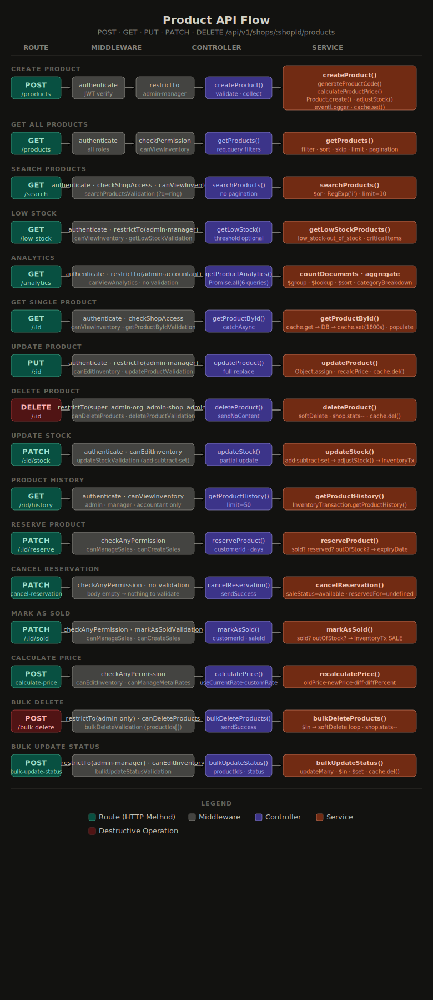

# Product API — Complete Documentation

> **Jewelry Shop Management System**
> Base URL: `/api/v1/shops/:shopId/products`

---

## Architecture Overview

Every request goes through this pipeline:

```
Request
   ↓
authenticate     → JWT token verify → req.user set hota hai
   ↓
restrictTo()     → Role check (super_admin, manager, etc.)
   ↓
checkShopAccess  → ShopId + OrganizationId match hota hai
   ↓
checkPermission  → Granular permission check (canManageProducts, etc.)
   ↓
rateLimiter      → Request limit per minute
   ↓
validation       → Body/Params/Query data check
   ↓
controller       → Data collect karo, service ko do
   ↓
service          → Actual DB kaam, business logic
   ↓
Response
```

### Key Concepts

| Layer | Kaam | Example |
|-------|------|---------|
| Route | URL define karo | `POST /` |
| Middleware | Request check karo | `authenticate`, `restrictTo` |
| Controller | Data collect + response | `req.body`, `sendCreated()` |
| Service | DB queries + logic | `Product.create()`, `cache.set()` |

---


## Roles & Permissions

```
super_admin  → sab kuch
org_admin    → sab kuch
shop_admin   → create, read, update, delete, analytics
manager      → create, read, update, stock, reserve, sell
staff        → read, reserve, sell
accountant   → read, analytics, history
user         → sirf read
```

### Permission Types

| Permission | Kaam |
|------------|------|
| `canManageProducts` | Product create karna |
| `canViewInventory` | Products dekhna |
| `canEditInventory` | Products update karna |
| `canDeleteProducts` | Products delete karna |
| `canViewAnalytics` | Analytics dekhna |
| `canManageSales` | Sales manage karna |
| `canCreateSales` | Sale banana |
| `canManageMetalRates` | Metal rates manage karna |

---
### 1. Backend — Route → Middleware → Controller → Service (All APIs)



## Routes

### 1. POST `/` — Create Product

**Rate Limit:** 50 req/min
**Roles:** super_admin, org_admin, shop_admin, manager
**Permission:** `canManageProducts`

**Request Body:**
```json
{
  "name": "Gold Ring 22K",
  "categoryId": "ObjectId",
  "subCategoryId": "ObjectId (optional)",
  "metal": {
    "type": "gold",
    "purity": "22K",
    "color": "yellow"
  },
  "weight": {
    "grossWeight": 10.5,
    "stoneWeight": 0.5,
    "unit": "gram"
  },
  "makingCharges": {
    "type": "per_gram",
    "value": 150
  },
  "pricing": {
    "sellingPrice": 55000,
    "costPrice": 48000,
    "gst": { "percentage": 3 },
    "discount": { "type": "flat", "value": 500 }
  },
  "stock": {
    "quantity": 5,
    "reorderLevel": 2
  }
}
```

**Service Flow:**
```
1. generateProductCode()     → PRD000001 generate karo (DB se last code lo)
2. MetalRate.getCurrentRate()→ Aaj ka metal rate lo (nahi mila → error)
3. Calculate netWeight       → grossWeight - stoneWeight
4. calculateProductPrice()   → metalValue + makingCharges + stoneValue + GST
5. Stone totalStonePrice     → stonePrice × pieceCount (DB save ke liye)
6. Stock status decide       → in_stock / low_stock / out_of_stock
7. Category validate         → parentId: null (top-level honi chahiye)
8. SubCategory validate      → parentId === categoryId (sahi parent honi chahiye)
9. Product.create()          → DB mein save
10. adjustStock()            → InventoryTransaction record (initial entry)
11. shop.statistics update   → totalProducts++ , totalInventoryValue++
12. eventLogger.logProduct() → Audit trail
13. cache.set(1800s)         → 30 min cache
```

**Price Calculation Formula:**
```
metalValue      = netWeight × metalRate
makingCharges   = per_gram: netWeight × value
                  percentage: metalValue × value / 100
                  flat: value
stoneValue      = Σ(stonePrice × pieceCount)
subtotal        = metalValue + makingCharges + stoneValue + otherCharges
discount        = percentage: subtotal × value / 100
                  flat: value
afterDiscount   = subtotal - discount
gstAmount       = afterDiscount × gstPercentage / 100
totalPrice      = afterDiscount + gstAmount ✅
```

**Stock Status Logic:**
```javascript
if (quantity === 0)                        → out_of_stock
else if (quantity <= reorderLevel)         → low_stock
else                                       → in_stock
```

**Response:** `201 Created`
```json
{
  "success": true,
  "message": "Product created successfully",
  "data": { /* product object */ }
}
```

---

### 2. GET `/` — Get All Products

**Rate Limit:** 100 req/min
**Roles:** All roles
**Permission:** `canViewInventory`

**Query Params:**
```
page        → Page number (default: 1)
limit       → Items per page (default: 20, max: 100)
sort        → Sort field (default: -createdAt)
category    → CategoryId (ObjectId)
metalType   → gold | silver | platinum | diamond | gemstone | mixed
purity      → 24K | 22K | 18K | 916 | 999 | 925 | etc.
status      → in_stock | out_of_stock | low_stock | discontinued
saleStatus  → available | reserved | sold | on_hold
minPrice    → Minimum sellingPrice
maxPrice    → Maximum sellingPrice
search      → Name / productCode / barcode / tags mein search
gender      → male | female | unisex | kids
```

**Service Logic:**
```
1. Query build karo (filters apply karo)
2. Promise.all([
     Product.find().skip().limit().populate(),  ← products
     Product.countDocuments()                    ← total count
   ])  → Dono parallel chalti hain (fast!)
3. Pagination calculate karo
   totalPages = Math.ceil(total / limit)
   skip = (page - 1) × limit
```

**Pagination Response:**
```json
{
  "data": [...],
  "pagination": {
    "currentPage": 2,
    "totalPages": 5,
    "pageSize": 20,
    "totalItems": 95,
    "hasNextPage": true,
    "hasPrevPage": true
  }
}
```

> **Note:** `Math.ceil` isliye use karte hain taaki last page ke products miss na ho.

---

### 3. GET `/search` — Search Products

**Rate Limit:** 100 req/min
**Roles:** All roles
**Permission:** `canViewInventory`

**Query Params:**
```
q     → Search query (required, 1-100 chars)
limit → Max results (default: 10, max: 50)
```

**Service Logic:**
```javascript
$or: [
  { name: RegExp(q, 'i') },        // case insensitive
  { productCode: RegExp(q, 'i') },
  { barcode: RegExp(q, 'i') },
  { huid: RegExp(q, 'i') },
  { tags: RegExp(q, 'i') },
]
```

> **getProducts vs searchProducts:**
> - `getProducts` → Full list with pagination (table/list view ke liye)
> - `searchProducts` → Quick top-10 results, no pagination (POS dropdown ke liye)

---

### 4. GET `/low-stock` — Low Stock Products

**Rate Limit:** 30 req/min
**Roles:** super_admin, org_admin, shop_admin, manager
**Permission:** `canViewInventory`

**Query Params:**
```
threshold → Optional. Agar diya → quantity <= threshold wale products
            Nahi diya → status=low_stock OR status=out_of_stock wale
```

**Response includes:**
```json
{
  "data": [...],
  "totalLowStockItems": 10,
  "criticalItems": 3
}
```

> `criticalItems` = quantity === 0 wale products (turant order karo!)

> **Cache nahi hai** — kyunki ye live critical data hai. Purana data dikhna dangerous!

---

### 5. GET `/analytics` — Product Analytics

**Rate Limit:** 20 req/min
**Roles:** super_admin, org_admin, shop_admin, manager, accountant
**Permission:** `canViewAnalytics`

**No request body/params needed.**

**Service — Promise.all(6 queries):**
```
1. countDocuments(total)
2. countDocuments(active)
3. countDocuments(low_stock)
4. countDocuments(out_of_stock)
5. aggregate(totalInventoryValue)   → $multiply + $sum
6. aggregate(categoryBreakdown)     → $group + $lookup + $sort
```

**categoryBreakdown Pipeline:**
```
$match  → shopId + organizationId filter
$group  → categoryId ke hisaab se group, count + value calculate
$sort   → count descending
$lookup → categories collection se naam lo (JOIN)
$addFields → categoryDetails array se naam nikalo ($arrayElemAt index 0)
```

> **Bug:** `require()` se import kiya hai — `import` use karna chahiye!

**Response:**
```json
{
  "overview": {
    "totalProducts": 100,
    "activeProducts": 85,
    "inactiveProducts": 15,
    "lowStockCount": 5,
    "outOfStockCount": 2,
    "totalInventoryValue": 5000000
  },
  "categoryBreakdown": [
    { "categoryName": "Gold Jewellery", "count": 60, "totalValue": 3500000 },
    { "categoryName": "Silver Jewellery", "count": 40, "totalValue": 1500000 }
  ]
}
```

---

### 6. GET `/:id` — Get Single Product

**Rate Limit:** 100 req/min
**Roles:** All roles
**Permission:** `canViewInventory`

**Service Flow:**
```
1. cache.get(productId) → Cache mein hai? Turant return ✅
2. Product.findOne()    → DB se fetch
   .populate('supplierId', 'name code contactPerson phone email')
   .populate('categoryId', 'name code')
   .populate('createdBy', 'firstName lastName email')
   .populate('updatedBy', 'firstName lastName email')
3. cache.set(1800s)     → Cache mein rakho (30 min)
```

> **Populate** = Mongoose ka `$lookup` shortcut — referenced collection se data laata hai.
> List (`getProducts`) mein `createdBy` populate nahi hota — unnecessary data!

---

### 7. PUT `/:id` — Update Product

**Rate Limit:** 50 req/min
**Roles:** super_admin, org_admin, shop_admin, manager
**Permission:** `canEditInventory`

**Important Rules:**
- `productCode` kabhi update nahi hota (immutable — Aadhaar number ki tarah!)
- Weight/makingCharges change → Price automatically recalculate hoti hai
- Category validate hoti hai (same as create)

**Service Flow:**
```
1. Product find karo
2. productCode delete karo (user ne bheja bhi toh ignore)
3. Weight/makingCharges updated? → calculateProductPrice() again
4. Quantity updated? → Stock status recalculate
5. Category validate karo
6. Object.assign(product, updateData) → Fields merge
7. product.save()
8. cache.del(productId)           → Old cache hatao
9. cache.deletePattern(products:*) → List cache bhi hatao
10. eventLogger
```

> **`Object.assign` order matter karta hai!**
> ```javascript
> // ✅ Sahi
> Object.assign(target, source)  // source target ko overwrite karta hai
> ```

---

### 8. DELETE `/:id` — Delete Product

**Rate Limit:** 10 req/min
**Roles:** super_admin, org_admin, shop_admin **ONLY**
**Permission:** `canDeleteProducts`

> **Manager delete nahi kar sakta** — bade decisions sirf owner le!

**Soft Delete vs Hard Delete:**
```
Hard Delete → Data forever gone ❌
Soft Delete → deletedAt: timestamp set, isActive: false
              Data hai DB mein, sirf hidden hai ✅
              Customer history, audit trail safe!
```

**Service Flow:**
```
1. Product find karo
2. product.softDelete()  → deletedAt = new Date(), isActive = false
3. shop.statistics update:
   totalProducts    = Math.max(0, totalProducts - 1)
   inventoryValue   = Math.max(0, value - sellingPrice × quantity)
   (Math.max(0) → kabhi negative nahi jayega!)
4. cache.del()
5. eventLogger
```

---

### 9. PATCH `/:id/stock` — Update Stock

**Rate Limit:** 50 req/min
**Roles:** super_admin, org_admin, shop_admin, manager
**Permission:** `canEditInventory`

**Request Body:**
```json
{
  "operation": "add | subtract | set",
  "quantity": 5,
  "reason": "New stock received",
  "referenceType": "purchase | manual_adjustment | etc."
}
```

**Operations:**
```
add      → Naya maal aaya     → previousQty + quantity
subtract → Bika / damage      → previousQty - quantity (0 se kam nahi jayega)
set      → Physical count     → Directly set karo
```

**Flow:**
```
→ adjustStock() → InventoryTransaction create (ADJUSTMENT)
→ cache.del()
→ eventLogger
```

> **Known Issue:** Session pass nahi kiya — concurrent requests mein race condition possible!

---

### 10. GET `/:id/history` — Product History

**Rate Limit:** 30 req/min
**Roles:** super_admin, org_admin, shop_admin, manager, accountant
**Permission:** `canViewInventory`

**Query Params:**
```
limit → Max records (default: 50)
```

**Service Flow:**
```
1. Product exist check (deleted bhi nahi hona chahiye)
2. InventoryTransaction.getProductHistory(productId, limit)
   → sort: transactionDate DESC (-1 = latest pehle)
   → populate: performedBy (name + email)
```

> **Pehle product check kyun?** Agar product delete ho chuka ho toh history dikhana galat hoga!

---

### 11. PATCH `/:id/reserve` — Reserve Product

**Rate Limit:** 50 req/min
**Roles:** super_admin, org_admin, shop_admin, manager, staff
**Permission:** `canManageSales` OR `canCreateSales` (checkAnyPermission)

**Request Body:**
```json
{
  "customerId": "ObjectId",
  "reservationDays": 7,
  "notes": "Customer ne kal aane ka promise kiya"
}
```

**Pre-checks (Early Exit):**
```
product.saleStatus === 'sold'     → Error: Already sold
product.saleStatus === 'reserved' → Error: Already reserved
product.stock.quantity < 1        → Error: Out of stock
```

**Service Flow:**
```
1. product.reserveProduct(customerId, days)
   → saleStatus = 'reserved'
   → reservedFor = { customerId, reservedDate, expiryDate }
2. InventoryTransaction.create (RESERVED)
3. cache.del()
4. eventLogger
```

> **Expiry Auto-Cancel nahi hai** — ye intentional hai! Customer late aaye toh staff manually decide kare.
> Production mein Cron Job lagao: `0 0 * * *` → expired reservations check karo.

---

### 12. PATCH `/:id/cancel-reservation` — Cancel Reservation

**Rate Limit:** 30 req/min
**Roles:** super_admin, org_admin, shop_admin, manager, staff
**Permission:** `canManageSales` OR `canCreateSales`

> **Validation nahi hai** — body empty hai, validate kya karein?

**Service Flow:**
```
1. saleStatus !== 'reserved' → Error
2. product.cancelReservation()
   → saleStatus = 'available'
   → reservedFor = undefined
3. InventoryTransaction.create (UNRESERVED)
4. cache.del()
5. eventLogger
```

---

### 13. PATCH `/:id/sold` — Mark As Sold

**Rate Limit:** 50 req/min
**Roles:** super_admin, org_admin, shop_admin, manager, staff
**Permission:** `canManageSales` OR `canCreateSales`

**Request Body:**
```json
{
  "customerId": "ObjectId",
  "saleId": "ObjectId (optional)"
}
```

**Pre-checks:**
```
product.saleStatus === 'sold'  → Error: Already sold
product.stock.quantity < 1    → Error: Out of stock
```

> **`reserved` check nahi hai** — Reserved product bhi sell ho sakta hai! Customer aa gaya toh directly sell karo.

**Service Flow:**
```
1. product.markAsSold(customerId)
   → saleStatus = 'sold'
   → soldDate = new Date()
   → soldTo = customerId
   → stock.quantity -= 1
2. InventoryTransaction.create (SALE)
3. cache.del()
4. eventLogger
```

---

### 14. POST `/:id/calculate-price` — Recalculate Price

**Rate Limit:** 30 req/min
**Roles:** super_admin, org_admin, shop_admin, manager
**Permission:** `canEditInventory` OR `canManageMetalRates`

**Request Body:**
```json
{
  "useCurrentRate": true,
  "customRate": 6000
}
```

> **POST kyun PATCH nahi?** Ye calculate karta hai + save karta hai. Body mein data bheja isliye POST.

**Service Flow:**
```
useCurrentRate = true  → MetalRate.getCurrentRate() se aaj ka rate lo
customRate diya        → Custom rate use karo
Dono nahi diya         → Error
```

**Response:**
```json
{
  "oldPrice": 50000,
  "newPrice": 55000,
  "difference": 5000,
  "differencePercentage": 10.00,
  "pricing": { /* full pricing object */ }
}
```

> **`differencePercentage` formula:**
> ```javascript
> oldPrice > 0 ? (difference / oldPrice) * 100 : 0
> // Division by zero se bachne ke liye!
> // toFixed(2) → 10.333... → "10.33" → parseFloat → 10.33
> ```

---

### 15. POST `/bulk-delete` — Bulk Delete

**Rate Limit:** 5 req/min ⚠️ (bahut kam — destructive operation!)
**Roles:** super_admin, org_admin, shop_admin ONLY
**Permission:** `canDeleteProducts`

**Request Body:**
```json
{
  "productIds": ["id1", "id2", "id3"]
}
```

> **POST kyun DELETE nahi?** DELETE method mein body nahi hoti!

**Service Flow:**
```
1. Product.find({ _id: { $in: productIds } })  → $in = ek query mein saare!
2. for loop → har product.softDelete()
3. shop.statistics.totalProducts -= deletedCount
4. cache.deletePattern(products:*)
5. eventLogger (bulk_delete)
```

> **Known Optimization Issue:** `for` loop mein ek ek softDelete → 100 products = 100 DB queries! 
> **Fix:** `Product.updateMany({ $in: productIds }, { $set: { deletedAt: new Date(), isActive: false } })`

---

### 16. POST `/bulk-update-status` — Bulk Update Status

**Rate Limit:** 20 req/min
**Roles:** super_admin, org_admin, shop_admin, manager
**Permission:** `canEditInventory`

**Request Body:**
```json
{
  "productIds": ["id1", "id2", "id3"],
  "status": "discontinued"
}
```

**Valid Status Values:** `in_stock | out_of_stock | low_stock | on_order | discontinued`

**Service Flow:**
```javascript
Product.updateMany(
  { _id: { $in: productIds }, shopId, organizationId, deletedAt: null },
  { $set: { status, updatedBy: userId, updatedAt: new Date() } }
)
```

> **`$set` kyun zaroori hai?** Bina `$set` ke poora document replace ho jaata! Sirf specific fields update karni hain.

> **bulk-delete vs bulk-update-status:**
> ```
> bulk-delete   → for loop → ek ek query  (100 products = 100 queries ❌)
> bulk-update   → updateMany → ek query   (100 products = 1 query ✅)
> ```

---

## Model — Key Methods

### Instance Methods

```javascript
product.softDelete()             // deletedAt = now, isActive = false
product.restore()                // deletedAt = null, isActive = true
product.updateStock(qty, op)     // add/subtract/set + status update
product.markAsSold(customerId)   // saleStatus=sold, soldDate, qty-=1
product.reserveProduct(cId, days)// saleStatus=reserved, expiryDate set
product.cancelReservation()      // saleStatus=available, reservedFor=undefined
product.calculatePrice(metalRate)// Full price recalculate + save
```

### Static Methods

```javascript
Product.generateProductCode(shopId, 'PRD')  // PRD000001 generate
Product.findByShop(shopId)
Product.findByCategory(shopId, categoryId)
Product.findLowStock(shopId)
Product.findAvailableForSale(shopId)
Product.searchProducts(shopId, searchTerm)
```

### Virtuals

```javascript
product.profitMargin      // (sellingPrice - costPrice) / costPrice × 100
product.isLowStock        // quantity <= reorderLevel
product.isOutOfStock      // quantity === 0
product.totalStoneCount   // Σ pieceCount
```

---

## Inventory Transactions

Har stock change pe `InventoryTransaction` record banta hai:

| Type | Kab |
|------|-----|
| `IN` | Stock add |
| `OUT` | Stock reduce |
| `ADJUSTMENT` | Manual / initial entry |
| `SALE` | Product bika |
| `PURCHASE` | Purchase se aaya |
| `RETURN` | Return hua |
| `RESERVED` | Reserve kiya |
| `UNRESERVED` | Reserve cancel |
| `TRANSFER_IN/OUT` | Shop transfer |
| `DAMAGE` | Damage/loss |

---

## Cache Strategy

```
cache.set(key, data, 1800)   // 30 min
cache.get(key)                // Check before DB query
cache.del(key)                // Delete on update/delete
cache.deletePattern(prefix*)  // List cache delete on any change
```

**Kab cache USE karte hain:**
- `getProductById` → Ek product baar baar fetch hota hai ✅

**Kab cache NAHI karte:**
- `getLowStock` → Live critical data — purana data dangerous!
- Analytics heavy data → Fresh chahiye

---

## Known Issues & Improvements

| Issue | Location | Fix |
|-------|----------|-----|
| `require()` bug | `getProductAnalytics` | `import` use karo |
| Bulk delete for loop | `bulkDeleteProducts` | `updateMany` use karo |
| Session missing | `updateStock → adjustStock` | Session pass karo |
| Custom rate single value | `recalculatePrice` | `mixed` metal ke liye alag rates chahiye |

---

## Route Order Rule

```javascript
// ✅ Sahi order — Static routes pehle, dynamic baad mein
router.get('/search', ...)    // static
router.get('/low-stock', ...) // static
router.get('/analytics', ...) // static
router.get('/:id', ...)       // dynamic — HAMESHA LAST

// ❌ Galat — /:id pehle hota toh /search → id="search" match ho jaata!
```

---

## Error Types

| Error | Kab |
|-------|-----|
| `ValidationError` | Metal rates nahi mili, Invalid category |
| `ProductNotFoundError` | Product DB mein nahi |
| `InsufficientStockError` | Stock kam hai |
| `DuplicateProductCodeError` | ProductCode already exists |

---

*Last updated: Product module complete review after learning session.*